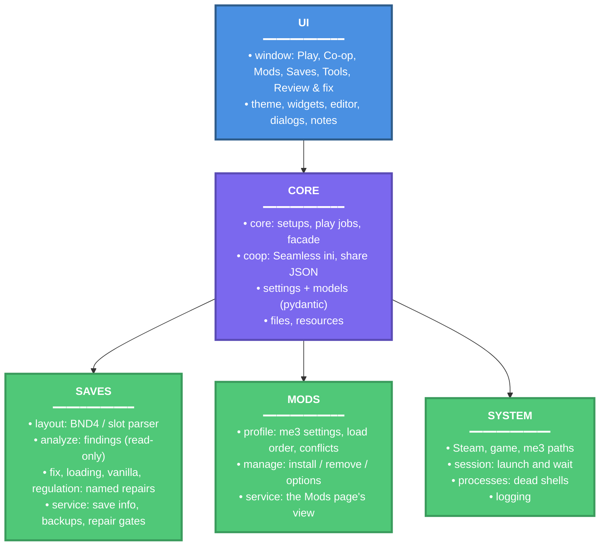

# Roundtable Souls

> Launcher and save toolkit for modded Elden Ring

A Windows desktop app (PySide6 + Fluent Widgets) that starts Elden Ring through [me3](https://github.com/garyttierney/me3), keeps Seamless Co-op settings in one place, manages me3 profiles and mods, and checks and repairs PC save files. It is the one window a co-op group needs open: pick a setup, press Play, and the saves are repaired and cleaned up when the game closes.

## Architecture Overview



The window never touches a save directly. Every read goes through `save_info`, every write through a named repair in `saves/` that verifies the new bytes, backs the original up next to the save, and refuses while the game is running. Data that crosses a layer boundary (save info, findings, mod plans) is validated against the pydantic models in `models.py` at the source.

## Key Features

- One-click Play through me3 or a Nightreign Revive installation, with Steam sign-in wait, dead-process cleanup and save repair after the game closes
- Seamless Co-op password and difficulty presets, plus a whole-file share format for a group
- me3 profile management: install mods from `.zip`, `.7z`, `.rar` or a folder, per-mod options, load order, conflict scan, profile create and delete
- Save health checks: checksums, regulation block, quest soft-locks, loading hangs, torn writes, non-vanilla items (DLC and Tarnished Edition aware)
- Opt-in, per-item repairs in a Review & fix workshop, every one backed up with a manifest and undoable
- Validated settings and boundary data (pydantic), atomic file writes, locks while the game runs

## Technologies Used

**Core Language & Runtime:**

- Python 3.14 (typed, `pathlib` throughout)
- uv (dependency resolver, virtual environment and build backend)

**Desktop UI:**

- PySide6 6.11 - Qt for Python
- PySide6-Fluent-Widgets 1.11 - Fluent design widgets

**Data & Files:**

- Pydantic 2 - settings validation
- py7zr - `.7z` mod archives (`.rar` uses the extractor already on the PC)

**Quality & Packaging:**

- pytest and coverage - tests
- ruff - lint, import order and formatting
- pyright - type checking (standard mode)
- PyInstaller - one-file `RoundtableSouls.exe`

## Getting Started

### Prerequisites

- Windows 10 or 11
- Steam with Elden Ring installed
- [me3](https://github.com/garyttierney/me3) installed, or a Nightreign Revive installation (which brings its own me3)
- For development: [uv](https://docs.astral.sh/uv/) (it installs Python 3.14 for you)

### Installing

Users: download `RoundtableSouls.zip`, unzip it into its own folder and double-click `RoundtableSouls.exe`. See [docs/How to use.txt](docs/How%20to%20use.txt).

Developers:

```bash
git clone <this repo>
cd roundtable-souls
uv sync
uv run roundtable-souls
```

### Configuration

The launcher keeps `launcher_settings.json` and a `logs/` folder next to the exe when that folder is writable, otherwise under `%LOCALAPPDATA%\RoundtableSouls`. Every key has a default in `settings.LauncherSettings`; a broken file falls back to the defaults. Tools > Locations overrides me3, the game exe and the profile folder when detection is wrong.

## Running the tests

```bash
uv run pytest
```

`tests/unit` runs anywhere. `tests/integration` exercises the repairs on temporary copies of a real Seamless Co-op save: the one under `%APPDATA%\EldenRing`, or the file named in `ROUNDTABLE_TEST_SAVE`. Without one they skip, so CI runs the unit tests only. The original save is never written.

With coverage:

```bash
uv run coverage run -m pytest
uv run coverage report
uv run coverage html
```

Lint, format and type-check:

```bash
uv run ruff check .
uv run ruff format --check .
uv run pyright
```

The same checks run before every commit once `uv run pre-commit install` has been run.

## Usage

```bash
uv run roundtable-souls              # the window
uv run roundtable-souls --check      # print detected setups and saves, no window
uv run roundtable-souls --shots DIR  # render every page to PNG files
```

Build the exe and the share bundle (`dist/share/RoundtableSouls.zip`):

```bash
uv run python scripts/build.py
```

Rebuild the bundled item lists from the reference repos (er-save-manager and Elden-Ring-Save-Editor checked out next to this repo, or the folder holding them in `ER_REPOS`):

```bash
uv run python scripts/build_known_ids.py
```

## Releases

Every push to `main` runs the tests (`.github/workflows/test.yml`). Pushing a version tag builds the exe on a Windows runner and publishes a GitHub Release with `RoundtableSouls.zip` attached (`.github/workflows/release.yml`). The tag must match the package version, and a test keeps `pyproject.toml` and `roundtable_souls.__version__` in sync.

```bash
uv run python scripts/bump_version.py 3.1.0   # updates pyproject.toml and __init__.py
git commit -am "Release 3.1.0"
git tag v3.1.0
git push && git push --tags
```

The Actions tab shows the build; the zip appears under Releases when it finishes. Users download it from there. The release workflow can also be started by hand from the Actions tab (`workflow_dispatch`), which uploads the zip as a build artifact without publishing a release.

## Documentation

- [docs/How to use.txt](docs/How%20to%20use.txt) - the user guide shipped in the zip
- [CHANGELOG.md](CHANGELOG.md) - version history
- [src/roundtable_souls/saves/README.md](src/roundtable_souls/saves/README.md) - save format facts the repairs rely on
- [src/roundtable_souls/mods/README.md](src/roundtable_souls/mods/README.md) - how profiles are edited
- [src/roundtable_souls/system/README.md](src/roundtable_souls/system/README.md) - detection and the play session

## Licensing

MIT, see [LICENSE](LICENSE).

## References

- [me3](https://github.com/garyttierney/me3) and [me3-manager](https://github.com/garyttierney/me3-manager) - mod loader and the install rules this launcher follows
- [er-save-manager](https://github.com/Ariiam/er-save-manager) - quest-flag and loading fixes, item tables
- [Elden-Ring-Save-Editor](https://github.com/ClayAmore/ER-Save-Editor) - save layout, Paramdex name tables
- [Seamless Co-op](https://www.nexusmods.com/eldenring/mods/510) - the ini this launcher edits
