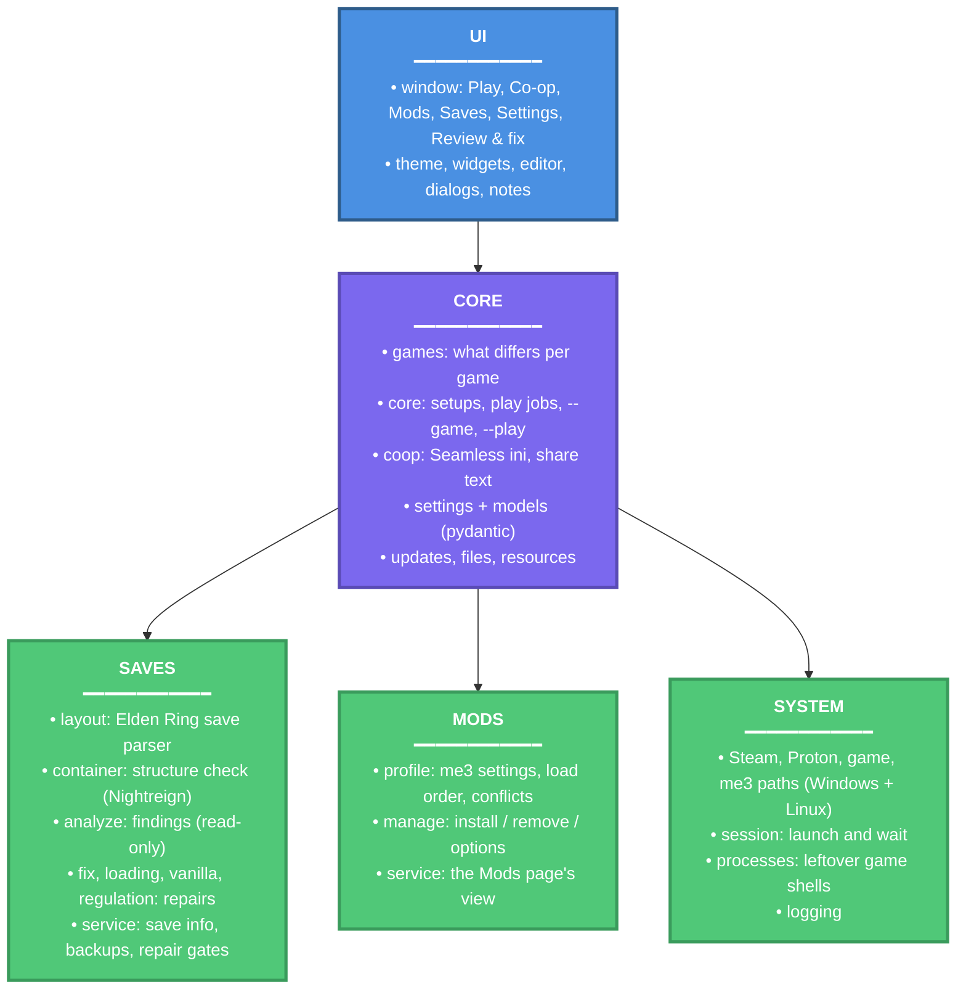

# Roundtable Souls

> Launcher and save toolkit for modded Elden Ring and Nightreign, on Windows, Linux and Steam Deck

A desktop app (PySide6 + Fluent Widgets) that starts Elden Ring and Nightreign through [me3](https://github.com/garyttierney/me3), keeps Seamless Co-op settings in one place, manages me3 profiles and mods, and checks and repairs PC save files. It is the one window a co-op group needs open: pick the game at the top, pick a setup, press Play, and the saves are looked after when the game closes. From Steam or a Steam Deck in Gaming Mode, a `--game <name> --play` shortcut does the same without the window. Dark Souls III and Sekiro have placeholder pages until their support lands.

## Architecture Overview



The window never touches a save directly. Every read goes through `save_info`, every write through a named repair in `saves/` that verifies the new bytes, backs the original up next to the save, and refuses while the game is running. Data that crosses a layer boundary (save info, findings, mod plans) is validated against the pydantic models in `models.py` at the source.

## Key Features

- Game switcher: Elden Ring and Nightreign, each with its own setup, co-op settings, mods and saves; placeholder pages for Dark Souls III and Sekiro
- One-click Play through me3 (or, for Elden Ring, a Nightreign Revive installation), with Steam sign-in wait, leftover-process cleanup and save repair after the game closes
- `--game <name> --play` for a Steam shortcut, Big Picture or Steam Deck Gaming Mode: the same session without the window, one shortcut per game
- Seamless Co-op for both games: password where the mod has one, difficulty (presets by party size for Elden Ring), every other setting explained, and a share format for a group
- me3 profile management: install mods from `.zip`, `.7z`, `.rar` or a folder, per-mod options, load order, conflict scan, profile create and delete
- Elden Ring save checks: checksums, the regulation block me3 dirties, loading hangs, torn writes, and items the game does not define, judged against the installed game's own item tables (so Shadow of the Erdtree and Tarnished Edition gear are always official); mod items are named from the mods' own files
- Nightreign saves: a structure check, backups, restore and co-op/standard copies (the game encrypts its saves, so their contents are not shown)
- Opt-in, per-item repairs on a Review & fix page, every one backed up and undoable; copies between standard and co-op saves
- Windows installer (per-user, no administrator prompt) or portable zip; Linux build for desktop and Steam Deck
- Update now: downloads the release for this kind of copy, checks it against published SHA-256 checksums, and restarts into it
- Responsive layout down to narrow windows and high display scaling; keyboard shortcuts; find and replace in the editors

## Technologies Used

**Core Language & Runtime:**

- Python 3.14 (typed, `pathlib` throughout)
- uv (dependency resolver, virtual environment and build backend)

**Desktop UI:**

- PySide6 6.11 - Qt for Python
- PySide6-Fluent-Widgets 1.11 - Fluent design widgets

**Data & Files:**

- Pydantic 2 - settings and boundary validation
- py7zr - `.7z` mod archives (`.rar` uses the extractor already on the PC)

**Quality & Packaging:**

- pytest and coverage - tests, on Windows and Linux in CI
- ruff - lint, import order and formatting
- pyright - type checking (standard mode)
- PyInstaller - one-file program for Windows and Linux
- Inno Setup - the Windows installer

## Getting Started

### Prerequisites

- Windows 10 or 11, or Linux (including SteamOS in Desktop Mode)
- Steam with Elden Ring or Nightreign installed
- [me3](https://github.com/garyttierney/me3), or for Elden Ring a Nightreign Revive installation (which brings its own me3)
- For development: [uv](https://docs.astral.sh/uv/) (it installs Python 3.14 for you)

### Installing

Users: download from [Releases](https://github.com/Carlomos7/roundtable-souls/releases/latest).

| File | For |
| --- | --- |
| `RoundtableSouls-Setup.exe` | Windows, installed per user (recommended) |
| `RoundtableSouls.zip` | Windows, portable |
| `RoundtableSouls-linux-x86_64.tar.gz` | Linux and Steam Deck |
| `SHA256SUMS.txt` | checksums for all of the above |

See [docs/How to use.txt](docs/How%20to%20use.txt) for the full guide.

Developers:

```bash
git clone https://github.com/Carlomos7/roundtable-souls.git
cd roundtable-souls
uv sync
uv run roundtable-souls
```

### Configuration

Settings are one validated JSON file, `launcher_settings.json`, with a default for every key in `settings.LauncherSettings`; a broken file falls back to the defaults. Installed copies keep it in `%LOCALAPPDATA%\RoundtableSouls`, portable copies next to the program (or in `%LOCALAPPDATA%` / `~/.local/share` when that folder is read-only). Settings > Locations overrides me3, the game and the profile folder when detection is wrong; the game executable is kept per game. Elden Ring's per-game values stay at the top level of the file, where older builds read them, and every other game's live under `games`.

## Running the tests

```bash
uv run pytest
```

`tests/unit` runs anywhere, including the window itself on Qt's offscreen platform. `tests/integration` exercises the repairs on temporary copies of a real Seamless Co-op save: the one this PC has, or the file named in `ROUNDTABLE_TEST_SAVE`. Without one they skip. The original save is never written.

With coverage:

```bash
uv run coverage run -m pytest
uv run coverage report
uv run coverage html
```

Lint, format and type-check:

```bash
uv run ruff check .
uv run ruff format --check .
uv run pyright
```

The same checks run before every commit once `uv run pre-commit install` has been run.

## Usage

```bash
uv run roundtable-souls                      # the window, on the game used last
uv run roundtable-souls --game nr            # the window, on Nightreign (this run only)
uv run roundtable-souls --game er --play     # Play Elden Ring without the window (Steam shortcut)
uv run roundtable-souls --game nr --check    # print what was detected for Nightreign
uv run roundtable-souls --shots DIR          # render every page to PNG files
```

Build for the current platform (tests, icon, PyInstaller, the installer when Inno Setup is available, the share bundle and checksums):

```bash
uv run python scripts/build.py
```

Rebuild the game item list from a local checkout of the item ID tables (`ER_SAVE_EDITOR`, or pass the folder):

```bash
uv run python scripts/build_item_list.py
```

## Branches

- `dev` is where work happens. Every push runs lint, type checks and tests on Windows and Linux, exactly as locked in `uv.lock`; a newer push cancels the older run. Changes to docs alone (README, changelog, `docs/`, licence files) skip the tests.
- `main` only receives merges from `dev` and is what releases are cut from. It requires the `tests-passed` check and refuses force-pushes.

```bash
git checkout dev                      # day-to-day work
git checkout main && git merge dev    # when dev is ready to ship
```

## Releases

Pushing a version tag releases (`.github/workflows/release.yml`). The workflow first checks that the tagged commit is on `main` and that the tag matches the package version, then builds and tests on Windows and Linux. The release is uploaded as a draft, every file is downloaded back and checked against `SHA256SUMS.txt`, and only then is it published. Only repository admins can create or move `v*` tags. Starting the workflow by hand from the Actions tab builds everything without publishing.

```bash
git checkout main && git merge dev
uv run python scripts/bump_version.py 3.3.0   # updates pyproject.toml and __init__.py
git commit -am "Release 3.3.0"
git tag v3.3.0
git push && git push --tags
```

## Documentation

- [docs/How to use.txt](docs/How%20to%20use.txt) - the user guide shipped with every download
- [CHANGELOG.md](CHANGELOG.md) - version history
- [src/roundtable_souls/saves/README.md](src/roundtable_souls/saves/README.md) - save format facts the repairs rely on
- [src/roundtable_souls/mods/README.md](src/roundtable_souls/mods/README.md) - how profiles are edited
- [src/roundtable_souls/system/README.md](src/roundtable_souls/system/README.md) - detection and the play session

## Licensing

GNU General Public License v3.0 or later, see [LICENSE](LICENSE). The window is built on PySide6-Fluent-Widgets, which is GPL-3.0. Other notices are in [THIRD_PARTY_NOTICES.md](THIRD_PARTY_NOTICES.md).

## Credits

- [me3](https://github.com/garyttierney/me3) - the mod loader this launcher drives
- [Seamless Co-op](https://www.nexusmods.com/eldenring/mods/510) - the settings files the Co-op page edits
