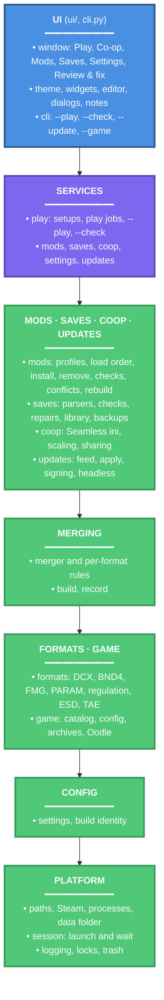

# Roundtable Souls

> Launcher and save toolkit for modded Elden Ring and Nightreign, on Windows, Linux and Steam Deck

A desktop app (PySide6 + Fluent Widgets) that starts Elden Ring and Nightreign through [me3](https://github.com/garyttierney/me3), keeps Seamless Co-op settings in one place, manages me3 profiles and mods, and checks and repairs PC save files. It is the one window a co-op group needs open: pick the game at the top, pick a setup, press Play, and the saves are looked after when the game closes. From Steam or a Steam Deck in Gaming Mode, a `--game <name> --play` shortcut does the same without the window. Dark Souls III and Sekiro have placeholder pages until their support lands.

## Architecture Overview



The window never touches a save directly. Every read goes through `save_info`, every write through a named repair in `saves/` that verifies the new bytes, backs the original up next to the save, and refuses while the game is running. Data that crosses a layer boundary (save info, findings, mod plans) is validated against the pydantic models in `saves/models.py` and `mods/models.py` at the source. Each package may import only from the ones below it in the diagram; CI checks it (`uv run lint-imports`, contracts in `pyproject.toml`).

## Key Features

- Game switcher: Elden Ring and Nightreign, each with its own setup, co-op settings, mods and saves; placeholder pages for Dark Souls III and Sekiro
- One-click Play through me3 (or, for Elden Ring, a Nightreign Revive installation), with Steam sign-in wait, leftover-process cleanup and save repair after the game closes
- `--game <name> --play` for a Steam shortcut, Big Picture or Steam Deck Gaming Mode: the same session without the window, one shortcut per game
- Seamless Co-op for both games: password where the mod has one, difficulty (presets by party size for Elden Ring), every other setting explained, and a share format for a group
- me3 profile management: install mods by drag and drop or from `.zip`, `.7z`, `.rar`, a `.dll` or a folder, choosing what to install and where a `regulation.bin` goes; entries checked the way me3 reads them; per-mod options, load order, settings files for DLL mods, conflict scan, profile create and delete
- Elden Ring save checks: checksums, the regulation block me3 dirties, loading hangs, torn writes, and items the game does not define, judged against the installed game's own item tables (so Shadow of the Erdtree and Tarnished Edition gear are always official); mod items are named from the mods' own files
- Nightreign saves: a structure check, backups, restore and co-op/standard copies (the game encrypts its saves, so their contents are not shown)
- Undo for mod changes: a copy of the profile before every change (Versions), removed mods to the Recycle Bin with Restore, Remove and rebuild for mods inside combined parameters, and Undo/Redo rebuild
- Opt-in, per-item repairs on a Review & fix page, every one backed up and undoable; copies between standard and co-op saves
- Parameter packs for Elden Ring: a green or red pill says whether they all apply, Load order explains every file two mods both ship; see which pack's regulation.bin applies, combine several into one so all of them apply (row by row against the game's own file), and keep an overhaul's own rebuild tool in step, with checks that say when the result is out of date and an update before Play when mods changed; files two mods ship (archives, text) merged against the game's own copy so both apply; the overhaul that must stay last stays last however mods are added, and that choice travels with the profile folder (roundtable.json)
- A save library of named copies to swap in, and copying a single character between saves or Steam accounts; backups kept in the launcher's own data folder
- Windows setup (per-user, no administrator prompt) or portable zip; Linux AppImage for desktop and Steam Deck; installs and updates through Velopack, with data kept outside the program folder
- Update now (or `--update` without the window): installs only what the release's minisign-signed feed lists, after checking every full or delta package against it; a version that does not start is undone and never installed again. Stable or Beta (pre-release) channel
- Activity: every Play, repair, install and rebuild with how it went and its full log (me3's output kept with each Play), a red count for failures you have not seen, and logs you can share with your user name and Steam IDs masked
- Responsive layout down to narrow windows and high display scaling; keyboard shortcuts; find and replace in the editors

## Technologies Used

**Core Language & Runtime:**

- Python 3.14 (typed, `pathlib` throughout)
- uv (dependency resolver, virtual environment and build backend)

**Desktop UI:**

- PySide6 6.11 - Qt for Python
- PySide6-Fluent-Widgets 1.11 - Fluent design widgets

**Data & Files:**

- Pydantic 2 - settings and boundary validation
- py7zr - `.7z` mod archives (`.rar` uses the extractor already on the PC)

**Quality & Packaging:**

- pytest and coverage - tests, on Windows and Linux in CI
- ruff - lint, import order and formatting
- pyright - type checking (standard mode)
- PyInstaller - the program folder for Windows and Linux
- Velopack - the Windows setup and portable zip, the Linux AppImage, and applying updates
- minisign - the release signature (signed in CI; checked in the launcher with `cryptography`)

## Getting Started

### Prerequisites

- Windows 10 or 11, or Linux (including SteamOS in Desktop Mode)
- Steam with Elden Ring or Nightreign installed
- [me3](https://github.com/garyttierney/me3), or for Elden Ring a Nightreign Revive installation (which brings its own me3)
- For development: [uv](https://docs.astral.sh/uv/) (it installs Python 3.14 for you)

### Installing

Users: download from [Releases](https://github.com/Carlomos7/roundtable-souls/releases/latest).

| File | For |
| --- | --- |
| `RoundtableSouls-Setup.exe` | Windows, installed per user (recommended) |
| `RoundtableSouls-win-Portable.zip` | Windows, portable |
| `RoundtableSouls-linux-x86_64.AppImage` | Linux and Steam Deck |
| `SHA256SUMS.txt` (+ `.minisig`) | checksums for every file, signed |
| `releases.win.json`, `releases.linux.json` (+ `.minisig`), `*.nupkg` | what Update now reads and installs |

See [docs/How to use.txt](docs/How%20to%20use.txt) for the full guide.

Developers:

```bash
git clone https://github.com/Carlomos7/roundtable-souls.git
cd roundtable-souls
uv sync
uv run roundtable-souls
```

### Configuration

Settings are one validated JSON file, `launcher_settings.json`, with a default for every key in `settings.LauncherSettings`; a broken file falls back to the defaults. Installed copies and the AppImage keep it in `%LOCALAPPDATA%\RoundtableSouls` (`~/.local/share/RoundtableSouls`), a portable copy in `RoundtableSouls-data` beside it, any copy in `ROUNDTABLE_SOULS_DATA` when that is set; never in the program folder, which updates replace (`settings.data_dir`). Settings > Locations overrides me3, the game and the profile folder when detection is wrong; the game executable is kept per game. Elden Ring's per-game values stay at the top level of the file, where older builds read them, and every other game's live under `games`.

## Running the tests

```bash
uv run pytest
```

`tests/unit` runs anywhere, including the window itself on Qt's offscreen platform. `tests/integration` exercises the repairs on temporary copies of a real Seamless Co-op save: the one this PC has, or the file named in `ROUNDTABLE_TEST_SAVE`. Without one they skip. The original save is never written.

With coverage:

```bash
uv run coverage run -m pytest
uv run coverage report
uv run coverage html
```

Lint, format and type-check:

```bash
uv run ruff check .
uv run ruff format --check .
uv run pyright
```

The same checks run before every commit once `uv run pre-commit install` has been run.

Import layers (which package may import which; the contracts are in `pyproject.toml`, under `[tool.importlinter]`):

```bash
uv run lint-imports --no-cache
```

## Usage

```bash
uv run roundtable-souls                      # the window, on the game used last
uv run roundtable-souls --game nr            # the window, on Nightreign (this run only)
uv run roundtable-souls --game er --play     # Play Elden Ring without the window (Steam shortcut)
uv run roundtable-souls --game nr --check    # print what was detected for Nightreign
uv run roundtable-souls --shots DIR          # render every page to PNG files
RoundtableSouls --update [--game er --play]  # (installed copy) update without the window, then restart
```

Build for the current platform (tests, icon, PyInstaller into `dist/RoundtableSouls`, then `vpk pack` and the release files in `dist/share`). `vpk` comes from `dotnet tool install vpk --version 1.2.161` (it must match the `velopack` package in `uv.lock`) and is found as `$VPK` or on `PATH`; without it the build stops after PyInstaller.

```bash
uv run python scripts/build.py
uv run python scripts/build.py --identity test.json   # an isolated test build: own app ID, title, feed and key
```

Rebuild the game item list from a local checkout of the item ID tables (`ER_SAVE_EDITOR`, or pass the folder):

```bash
uv run python scripts/build_item_list.py
```

## Branches

- `dev` is where work happens. Every push runs lint, type checks and tests on Windows and Linux, exactly as locked in `uv.lock`; a newer push cancels the older run. Changes to docs alone (README, changelog, `docs/`, licence files) skip the tests.
- `main` only receives merges from `dev` and is what releases are cut from. It requires the `tests-passed` check and refuses force-pushes.

```bash
git checkout dev                      # day-to-day work
git checkout main && git merge dev    # when dev is ready to ship
```

## Releases

Pushing a version tag releases (`.github/workflows/release.yml`).

1. **Verify.** The tagged commit must be on `main`, and the tag must match the package version.
2. **Build.** Windows and Linux each lint, test, build with PyInstaller and pack with `vpk` 1.2.161. Before packing, they fetch the previous release's full package with `vpk download github`, so the release also carries a delta for copies one version behind.
3. **Install test (Windows only).** `scripts/ci/velopack-install-test.ps1` installs the latest published release, then the new setup. It checks that the old Inno install is replaced, the data is kept and the Start menu shortcut points at the new copy, then that uninstalling keeps the data.
4. **Sign.** The publish job signs each feed (`releases.win.json`, `releases.linux.json`; trusted comment `roundtable-souls <version> <os>`) and `SHA256SUMS.txt` with minisign.
5. **Publish to beta.** The release is uploaded as a draft. Every file is downloaded back and checked against the checksums and the signatures, and only then is the release published, as a pre-release: the Beta channel offers it, Stable does not.
6. **Promote to stable.** When the beta has been used for a while, run the **Promote** workflow (`.github/workflows/promote.yml`) from the Actions tab with the tag. It checks that the release is a published beta, newer than the stable one, that its Release run succeeded, and every file against its checksum and signature, then marks the same release as the latest: Stable offers it from then on. Nothing is rebuilt. A tag with a suffix (`v3.4.0-rc.1`) stays a beta; it cannot be promoted, since the launcher's Stable channel refuses such versions. A fix found in beta ships as the next version.

Only repository admins can create or move `v*` tags. Starting the workflow by hand from the Actions tab builds and tests everything without publishing.

```bash
git checkout main && git merge dev
uv run python scripts/bump_version.py 3.3.0   # pyproject.toml and __init__.py (3.4.0-rc.1 for a pre-release)
uv lock                                       # uv.lock records the version; the release builds --locked
git commit -am "Release 3.3.0"
git tag -a v3.3.0 -m "Roundtable Souls 3.3.0"
git push && git push --tags                   # builds, tests and publishes 3.3.0 as a beta
# later: Actions tab -> Promote -> v3.3.0      # the same release becomes the stable one
```

Updates, failed-start rollback, the Inno migration, portable data and uninstall are tested end to end on isolated test builds (their own app ID, data folder, feed and key) before a release; Steam Deck checks are done by hand. Signing needs the `MINISIGN_KEY` repository secret (the minisign secret key file, without a password); the matching public key is `src/roundtable_souls/data/release-signing.pub`. Replacing the key is described in [docs/decisions/0003-signed-releases.md](docs/decisions/0003-signed-releases.md).

`advisory.json` on `main` is read with every update check: setting `"minimum"` to a version (with a `"message"` and, optionally, a `"url"`) shows every older copy a notice asking it to update. It only warns.

## Documentation

- [docs/How to use.txt](docs/How%20to%20use.txt) - the user guide shipped with every download
- [CHANGELOG.md](CHANGELOG.md) - version history
- [src/roundtable_souls/saves/README.md](src/roundtable_souls/saves/README.md) - save format facts the repairs rely on
- [src/roundtable_souls/mods/README.md](src/roundtable_souls/mods/README.md) - how profiles are edited
- [src/roundtable_souls/platform/README.md](src/roundtable_souls/platform/README.md) - detection and the play session

## Licensing

GNU General Public License v3.0 or later, see [LICENSE](LICENSE). The window is built on PySide6-Fluent-Widgets, which is GPL-3.0. Other notices are in [THIRD_PARTY_NOTICES.md](THIRD_PARTY_NOTICES.md).

## Credits

- [me3](https://github.com/garyttierney/me3) - the mod loader this launcher drives
- [Seamless Co-op](https://www.nexusmods.com/eldenring/mods/510) - the settings files the Co-op page edits
